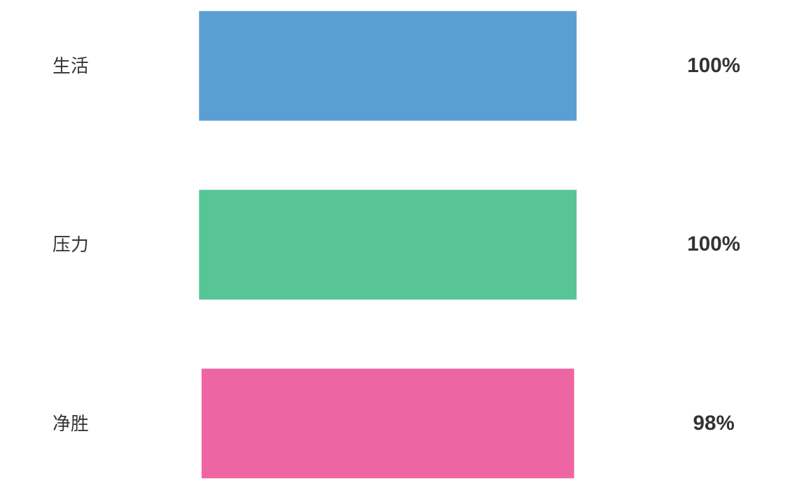
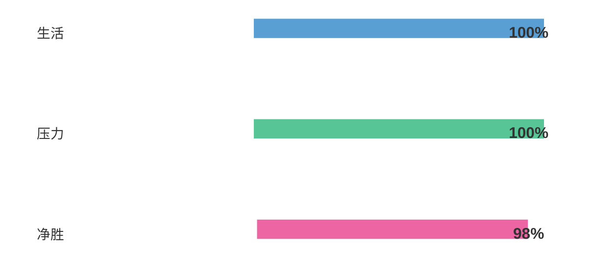
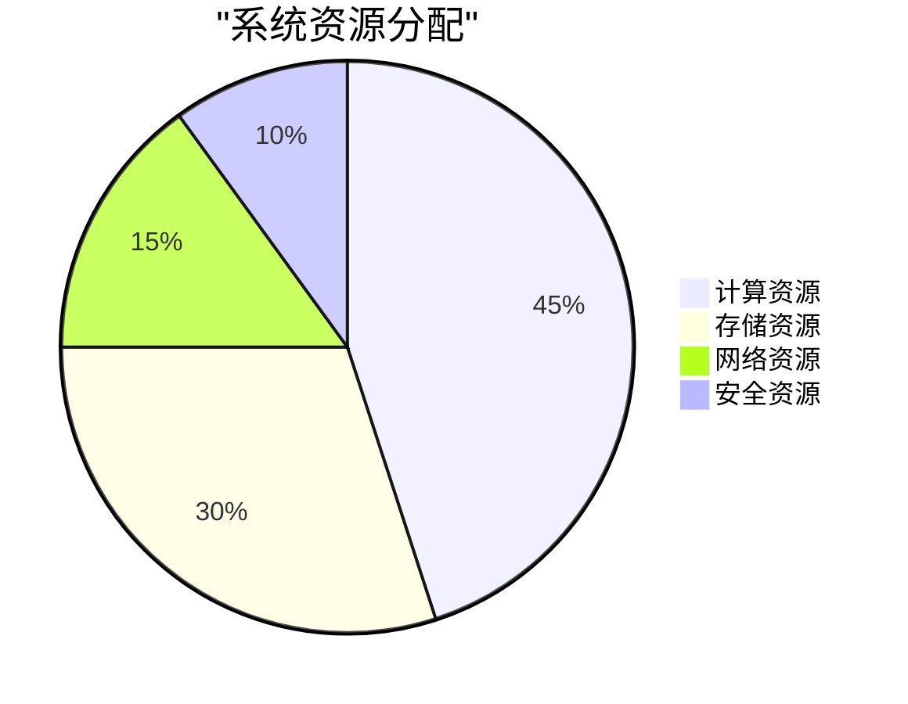
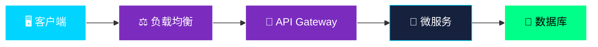

<div align="center">

# 🤖 <span style="color:#00d4ff; text-shadow: 0 0 15px #00d4ff, 0 0 30px #00d4ff;">AI-Powered SaaS Platform</span>


</div>

> 🔮 AI-Driven · ⚡ Cloud-Native · 🎨 Modern Architecture · 📊 Data-First


---






```mermaid
flowchart LR
    L1["生活"] --- B1["&nbsp;&nbsp;&nbsp;&nbsp;&nbsp;&nbsp;&nbsp;&nbsp;&nbsp;&nbsp;&nbsp;&nbsp;&nbsp;&nbsp;&nbsp;&nbsp;&nbsp;&nbsp;&nbsp;&nbsp;&nbsp;&nbsp;&nbsp;&nbsp;&nbsp;&nbsp;"] --- V1["100%"]
    L2["压力"] --- B2["&nbsp;&nbsp;&nbsp;&nbsp;&nbsp;&nbsp;&nbsp;&nbsp;&nbsp;&nbsp;&nbsp;&nbsp;&nbsp;&nbsp;&nbsp;&nbsp;&nbsp;&nbsp;&nbsp;&nbsp;&nbsp;&nbsp;&nbsp;&nbsp;&nbsp;&nbsp;"] --- V2["100%"]
    L3["净胜"] --- B3["&nbsp;&nbsp;"] --- V3["98%"]

    classDef default fill:none,stroke:none
    classDef label fill:none,stroke:none,color:#333,font-size:14px,
    classDef value fill:none,stroke:none,color:#333,font-size:16px,font-weight:bold
    classDef barBlue fill:#5a9fd4,stroke:none,border-radius:16px,font-size:1px,line-height:1.2,padding:0px 0,width: 300,height: 20
    classDef barGreen fill:#57c596,stroke:none,border-radius:16px,font-size:1px,line-height:1.2,padding:0px 0,width: 300,height: 20
    classDef barPink fill:#ed66a3,stroke:none,border-radius:16px,font-size:1px,line-height:1.2,padding:0px 0,width: 280,height: 20

    class L1,L2,L3 label
    class V1,V2,V3 value
    class B1 barBlue
    class B2 barGreen
    class B3 barPink

    linkStyle default stroke:none,stroke-width:0
```


## 📊 核心指标

<div align="center">

## 📊 核心指标

| 指标 | 柱状图 | 数值 |
|------|--------|------|
| 用户增长 | <span style="color:#8b5cf6">████████████████████████████░░░░░░░░░░░░</span> | 85% |
| 系统性能 | <span style="color:#06b6d4">████████████████████████████████░░░░░░░░</span> | 92% |
| 客户满意度 | <span style="color:#f59e0b">████████████████████████████░░░░░░░░░░</span> | 78% |

</div>

## 🥧 资源分配

<div align="center">



</div>

| 资源类型 | 占比 | 说明 |
|:--------:|:----:|------|
| 计算资源 | 45% | CPU/GPU 计算能力 |
| 存储资源 | 30% | 数据库/文件存储 |
| 网络资源 | 15% | 带宽/CDN 分发 |
| 安全资源 | 10% | 加密/认证/审计 |

---

## 🗂️ 项目结构

```text
saas-platform/
├── 📄 README.md              # 项目说明
├── 📄 package.json           # 依赖配置
├── 📄 .env.example           # 环境变量模板
│
├── 📁 frontend/              # 前端代码
│   ├── 📁 src/
│   │   ├── 📁 components/    # 组件
│   │   ├── 📁 views/         # 页面
│   │   └── 📄 main.js        # 入口
│   └── 📄 vite.config.js     # 构建配置
│
├── 📁 backend/               # 后端代码
│   ├── 📁 api/               # 接口层
│   ├── 📁 controllers/       # 控制器
│   ├── 📁 models/            # 数据模型
│   └── 📄 server.js          # 服务入口
│
├── 📁 services/              # 微服务
│   ├── 🔐 auth-service/      # 认证服务
│   ├── 💳 payment-service/   # 支付服务
│   └── 📧 notification/      # 通知服务
│
├── 📁 database/              # 数据库
│   ├── 📁 migrations/        # 迁移文件
│   └── 📄 connection.js      # 连接配置
│
└── 📁 docs/                  # 文档
    ├── 📄 API.md             # 接口文档
    └── 📄 DEPLOYMENT.md      # 部署指南
```

---

## 📈 系统架构

<div align="center">



</div>

---

## 🚀 快速开始

### 环境要求

| 软件 | 版本 |
|:----:|:----:|
| Node.js | 18.0+ |
| Docker | 20.0+ |
| PostgreSQL | 14.0+ |
| Redis | 6.0+ |

### 安装步骤

```bash
# 1. 克隆项目
git clone https://github.com/yourname/saas-platform.git

# 2. 安装依赖
npm install

# 3. 配置环境
cp .env.example .env

# 4. 启动服务
npm run dev
```

### 访问地址

| 服务 | 地址 |
|:----:|:----:|
| 前端 | http://localhost:3000 |
| 后端 | http://localhost:8000 |
| 数据库 | localhost:5432 |

---

## 🛡️ 安全特性

| 特性 | 状态 |
|:----:|:----:|
| JWT 认证 | ✅ |
| HTTPS | ✅ |
| 数据加密 | ✅ |
| 访问控制 | ✅ |
| 审计日志 | ✅ |

---

## 📞 联系我们

<div align="center">

| 📧 Email | 🌐 Website | 💬 Discord |
|:--------:|:----------:|:----------:|
| support@saas-platform.com | saas-platform.com | [加入社区](https://discord.gg/yourlink) |

</div>

---

<div align="center">

### Made with ❤️ by Your Team


</div>

---

<div align="center">

| 版本 | 日期 | 说明 |
|:----:|:----:|:----:|
| v1.0.0 | 2024-01-15 | 正式发布 |
| v0.9.0 | 2024-01-10 | Beta 测试 |
| v0.8.0 | 2024-01-05 | Alpha 内测 |

</div>


